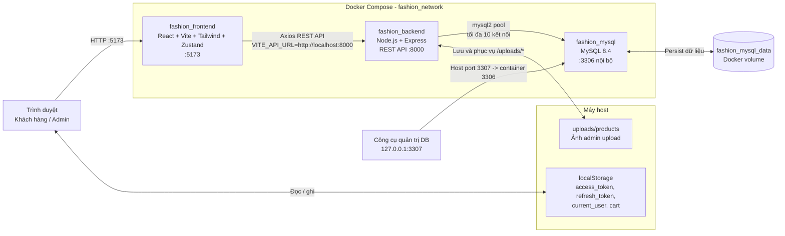
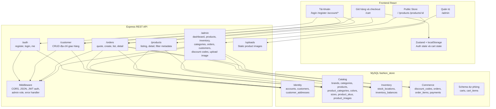
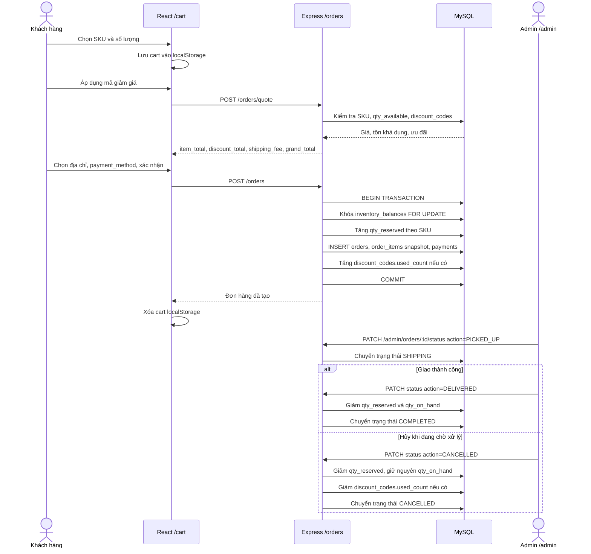
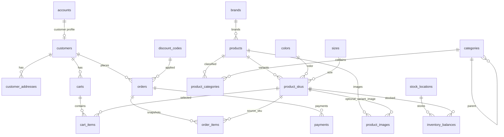

# Sơ đồ toàn bộ hệ thống Fashion Store

Tài liệu này phản ánh code hiện tại trong `frontend`, `backend`, `mysql/init` và
`docker-compose.yml`.

## 1. Kiến trúc triển khai



## 2. Bản đồ chức năng và API



Ghi chú:

- Giỏ hàng hiện tại được lưu ở `localStorage`, chưa dùng bảng `carts` và
  `cart_items`.
- Backend phát cả access token và refresh token, nhưng hiện chưa có endpoint
  refresh token.
- `COD`, `BANK_TRANSFER`, `MOMO`, `ZALOPAY` hiện chỉ được ghi vào đơn hàng.
  Project chưa tích hợp cổng thanh toán hoặc webhook bên ngoài.

## 3. Luồng checkout và xử lý tồn kho



## 4. Quan hệ dữ liệu chính



## 5. Nhóm endpoint

| Nhóm | Endpoint chính | Quyền truy cập |
|---|---|---|
| Hệ thống | `GET /`, `GET /health`, `GET /uploads/*` | Public |
| Xác thực | `POST /auth/register`, `POST /auth/login`, `GET /auth/me` | Public / JWT |
| Catalog | `GET /products`, `GET /products/:id`, `GET /products/search/*` | Public |
| Địa chỉ | `GET POST DELETE /customer/addresses...` | Customer có JWT |
| Đơn hàng | `POST /orders/quote`, `POST /orders`, `GET /orders...` | Customer có JWT |
| Admin | `/admin/dashboard`, `/admin/products...`, `/admin/inventory...`, `/admin/categories...`, `/admin/orders...`, `/admin/customers`, `/admin/discount-codes...`, `/admin/uploads/product-image` | Admin có JWT |

## 6. Khởi tạo dữ liệu

Khi MySQL tạo volume mới, các script trong `mysql/init` chạy theo thứ tự:

```text
001_schema.sql
002_seed.sql
003_admin.sql
004_category_names_vi.sql
005_commerce_features.sql
006_repair_vietnamese_text.sql
```

`005_commerce_features.sql` bổ sung `discount_codes` và liên kết
`orders.discount_code_id`.
